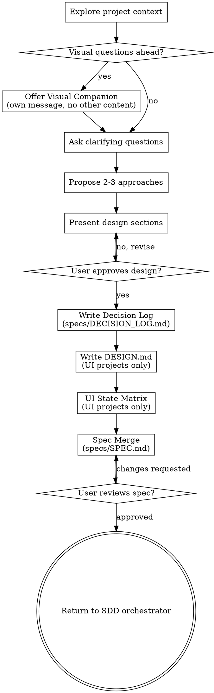

<!-- CAVEMAN-ENCODED. DECODER: ! = must/required | ⊥ = forbidden/never | → = leads to/becomes | ∀ = for all | ∃ = exists | § = section ref | & = and | | = or -->

# Brainstorming Ideas Into Designs

Turn ideas → fully formed designs & specs through collaborative dialogue.

Start: understand project context → ask questions one at a time → present design → get user approval.

**⛔ GATE:** ⊥ invoke implementation skills, write code, scaffold projects, or take implementation action until design presented & user approved. Applies to EVERY project regardless of perceived simplicity.

## Anti-Pattern: "Too Simple To Need Design"

Every project goes through this. Todo list, single-function utility, config change — all of them. "Simple" projects = where unexamined assumptions cause most wasted work. Design can be short (few sentences for truly simple projects), but ! present it & get approval.

## Checklist

! create task for each item, complete in order:

1. **Explore project context** — check files, docs, recent commits
2. **Offer visual companion** (if visual questions ahead) — own message, not combined with clarifying question. See Visual Companion section.
2b. **Theme & Vibe Brainstorming** (UI only) — ask user for theme/aesthetic/vibe → propose 2-3 matching designs → iterate until approved. See Theme & Vibe section.
3. **Ask clarifying questions** — one at a time, understand purpose/constraints/success criteria
3b. **Confidence Self-Assessment** — score understanding across 5 dimensions, ! reach ≥85 before proposing approaches. See Confidence Self-Assessment section.
4. **Propose 2-3 approaches** — with trade-offs & recommendation
5. **Present design** — sections scaled to complexity, get approval after each
6. **Write decision log** — consolidate decisions → `specs/DECISION_LOG.md`. See [decision-log-template.md](file://{{SKILLS_DIR}}/shared/decision-log-template.md).
7. **Write DESIGN.md** (UI only) — produce `specs/DESIGN.md`. ! pass Design Token Completeness Checklist. See [design-template.md](file://{{SKILLS_DIR}}/shared/design-template.md). ⊥ resolve → use fallback structure below.
8. **UI State Matrix** (UI only) — walk ∀ interactive component through 5 states (Empty, Loading, Success, Error, Edge Case). NOT optional.
9. **Spec Merge** — update `specs/SPEC.md` with structural decisions.
10. **User reviews spec** — ask user to review before proceeding
11. **Transition** — Return control to `spec-driven-development` orchestrator. ⊥ invoke downstream skills directly.

## Process Flow

Terminal state = return control to `spec-driven-development` orchestrator. ⊥ invoke frontend-design, mcp-builder, adversarial-swarm-analysis, or any other skill directly.

## The Process

**Understanding the idea:**
- Check current project state first (files, docs, recent commits)
- Before detailed questions, assess scope: request describes multiple independent subsystems → flag immediately. Don't refine details of project needing decomposition first.
- Project too large for single spec → help decompose into sub-projects. Each sub-project gets own spec → plan → implementation cycle.
- For appropriately-scoped projects, ask questions one at a time
- Prefer multiple choice when possible, open-ended fine too
- Only one question per message — if topic needs more exploration, break into multiple questions
- Focus: purpose, constraints, success criteria

**⛔ GATE:** ∀ message during clarifying questions (Step 3) ! contain exactly ONE question. Multiple questions | bullet-pointed sub-questions | batched categories = process violation. Need multiple topics → send multiple messages across multiple turns. "Being helpful" by batching = anti-pattern → partial answers & unexamined assumptions.

**Exploring approaches:**
- Propose 2-3 approaches with trade-offs
- Lead with recommended option & explain why

## Confidence Self-Assessment (Step 3b)

**⛔ GATE:** ⊥ propose approaches (Step 4) until Confidence Self-Assessment score ≥85. ! re-score after each round of clarifying questions.

Read & execute full rubric: [confidence-assessment.md](file://{{SKILLS_DIR}}/brainstorming/references/confidence-assessment.md)

**Presenting the design:**
- Present design when you understand what you're building
- Scale each section to complexity: few sentences if straightforward, up to 200-300 words if nuanced
- Ask after each section whether it looks right
- Cover: architecture, components, data flow, error handling, testing
- Ready to go back & clarify if something doesn't make sense

**Design for isolation & clarity:**
- Break system → smaller units: one clear purpose, well-defined interfaces, independently testable
- ∀ unit, answer: what does it do, how to use it, what depends on?
- Can someone understand unit without reading internals? Can you change internals without breaking consumers? No → boundaries need work.
- Smaller well-bounded units = easier to work with. You reason better about code that fits in context. Large file = signal it's doing too much.

**Working in existing codebases:**
- Explore current structure before proposing changes. Follow existing patterns.
- Where existing code has problems affecting work → include targeted improvements as part of design
- ⊥ propose unrelated refactoring. Stay focused on current goal.

## Decision Log (Step 5b)

**Rules:**
- ∀ decision during brainstorming ! appear in table — even obvious ones
- User selected from options → list all options considered
- AI recommended & user approved → note in Rationale
- Decision involves numeric parameter → Choice column ! contain exact value | range — not vague language

See [decision-log-template.md](file://{{SKILLS_DIR}}/shared/decision-log-template.md).

## Theme & Vibe Brainstorming (Step 2b — UI Only)

Read & execute full process: [theme-brainstorming.md](file://{{SKILLS_DIR}}/brainstorming/references/theme-brainstorming.md)

## DESIGN.md (UI Only)

∃ visual UI → produce `specs/DESIGN.md`.

**Template, checklist, conventions:** See [design-template.md](file://{{SKILLS_DIR}}/shared/design-template.md).

⊥ resolve reference → use fallback structure. Log: "Design template unavailable — using inline fallback."

Fallback DESIGN.md Structure (use only if reference unresolvable)

DESIGN.md ! contain YAML token blocks for:
- **Colors:** `primary`, `secondary`, `accent`, `background`, `surface`, `text`, `error`, `success`
- **Typography:** `fontFamily` (heading, body, mono), `fontSize` scale, `fontWeight`, `lineHeight`
- **Spacing:** scale (xs through 3xl), `containerMaxWidth`, `sectionPadding`
- **Borders:** `borderRadius` scale, `borderWidth`, `borderColor`
- **Shadows:** elevation scale (sm, md, lg, xl)
- **Animations:** `duration` (fast, normal, slow), `easing` (default, spring)
- **Components:** ∀ component ! define `backgroundColor`, `textColor`, `rounded`. Interactive components ! have `hover`, `focus`, `disabled` sub-objects.

Component naming: DESIGN.md uses kebab-case → SPEC.md uses PascalCase.

**⛔ GATE:** DESIGN.md ⊥ be written until ∀ mandatory category ∈ Design Token Completeness Checklist has defined tokens. Agent ! generate best-practice defaults matching approved theme ∀ categories — user doesn't define manually.

**Hard Rule:** ∃ `DESIGN.md` → authoritative source ∀ visual values. Dev Swarm ! read before generating frontend component code.

## UI State Matrix (Step 5d — UI Only)

Read & execute full matrix process: [ui-state-matrix.md](file://{{SKILLS_DIR}}/brainstorming/references/ui-state-matrix.md)

## After the Design

**⛔ GATE:** ⊥ write to `specs/SPEC.md`, `specs/DESIGN.md`, or any spec file until Present Design step complete AND user explicitly approved each design section. Writing spec files before design approval = process violation — creates anchoring bias that discourages iteration.

**Documentation:**
- `specs/` = single source of truth. Write `specs/DECISION_LOG.md`, update `specs/SPEC.md`, and (if UI) create `specs/DESIGN.md`.
- Save written files to disk

## Spec Merge

After user approves design, merge decisions into spec:

**⛔ GATE:** Brainstorming ⊥ return control to SDD until `SPEC.md` updated & saved to disk.

1. Read current `specs/SPEC.md`
2. ∀ decision → determine if it introduces: new component | data flow | API contract | behavioral change
3. Draft `specs/SPEC.md` modifications, present to user
4. `specs/DECISION_LOG.md` = "why" behind each decision. Both ! reflect same decisions as `SPEC.md`.
5. Save updated `specs/SPEC.md`

**`specs/` folder = single source of truth:**

| Document | Purpose | Consumed By |
|----------|---------|-------------|
| `specs/SPEC.md` | **What** to build — contracts, hierarchy, data flow, invariants, tasks | Adversarial swarm, dev swarm |
| `specs/DESIGN.md` | **How it looks** — visual tokens, layout, states, interaction patterns | Dev swarm (Frontend Engineer) |
| `specs/DECISION_LOG.md` | **Why** we build this way — options & rationale | Context for humans & swarms |
| `specs/IMPLEMENTATION_PHASES.md` | **In what order** — sequenced, testable phases | Dev swarm (execution order) |

**Spec Self-Review:**

**⛔ GATE:** Skip this section. `spec-driven-development` orchestrator enforces full 14-step completeness gate after adversarial hardening.

**User Review Gate:**
After writing spec, ask user to review before returning to SDD:

> "Spec written and saved to `<path>`. Please review it and let me know if you want to make any changes before I return to the SDD orchestrator for hardening."

Wait for response. Changes requested → make them. Proceed only after user approves.

**Transition:**
Return control to `spec-driven-development` orchestrator. ⊥ invoke downstream skills. SDD determines next step from artifact state on disk.

## Key Principles

- **One question at a time** — don't overwhelm
- **Multiple choice preferred** — easier to answer when possible
- **YAGNI ruthlessly** — remove unnecessary features
- **Explore alternatives** — always propose 2-3 approaches
- **Incremental validation** — present design, get approval before moving on
- **Be flexible** — go back & clarify when needed

## Visual Companion

Browser-based companion for mockups, diagrams, visual options. Available as tool — not mode. Accepting = available for visual questions; ⊥ every question goes through browser.

**Offering:** When upcoming questions will involve visual content, offer once for consent:
> "Some of what we're working on might be easier to explain if I can show it to you in a web browser. I can put together mockups, diagrams, comparisons, and other visuals as we go. This feature is still new and can be token-intensive. Want to try it? (Requires opening a local URL)"

**! be its own message.** ⊥ combine with clarifying questions, context summaries, or other content. Message = ONLY the offer above. Wait for response. Declined → proceed text-only.

**Per-question decision:** Even after acceptance, decide ∀ question: browser | terminal. Test: **would user understand better by seeing it than reading it?**

- **Browser** for visual content — mockups, wireframes, layout comparisons, architecture diagrams, side-by-side designs
- **Terminal** for text content — requirements questions, conceptual choices, tradeoff lists, scope decisions

UI topic ≠ automatically visual question. "What does personality mean in this context?" = conceptual → terminal. "Which wizard layout works better?" = visual → browser.

If they agree, read detailed guide: [visual-companion.md](file://{{SKILLS_DIR}}/shared/visual-companion.md)
