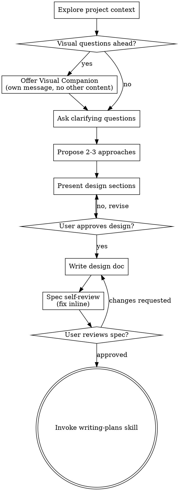

# Brainstorming Ideas Into Designs

Help turn ideas into fully formed designs and specs through natural collaborative dialogue.

Start by understanding the current project context, then ask questions one at a time to refine the idea. Once you understand what you're building, present the design and get user approval.

<HARD-GATE>
Do NOT invoke any implementation skill, write any code, scaffold any project, or take any implementation action until you have presented a design and the user has approved it. This applies to EVERY project regardless of perceived simplicity.
</HARD-GATE>

## Anti-Pattern: "This Is Too Simple To Need A Design"

Every project goes through this process. A todo list, a single-function utility, a config change — all of them. "Simple" projects are where unexamined assumptions cause the most wasted work. The design can be short (a few sentences for truly simple projects), but you MUST present it and get approval.

## Checklist

You MUST create a task for each of these items and complete them in order:

1. **Explore project context** — check files, docs, recent commits
2. **Offer visual companion** (if topic will involve visual questions) — this is its own message, not combined with a clarifying question. See the Visual Companion section below.
2b. **Design Triage** (UI projects only) — present the 10 Design Token Categories (see below) and ask the user which they want to actively review vs. delegate. See the Design Triage section below.
3. **Ask clarifying questions** — one at a time, understand purpose/constraints/success criteria
3b. **Confidence Self-Assessment** — score understanding across 5 dimensions before proceeding. MUST reach ≥85 to propose approaches. See the Confidence Self-Assessment section below.
4. **Propose 2-3 approaches** — with trade-offs and your recommendation
5. **Present design** — in sections scaled to their complexity, get user approval after each section
5b. **Write decision log** — consolidate all decisions made during brainstorming into a structured table (see Decision Log section below)
5c. **Write DESIGN.md** (UI projects only) — if the brainstormed feature involves visual UI, produce a `DESIGN.md` in the project's `specs/` directory. MUST pass the Design Token Completeness Checklist. See the DESIGN.md section below.
5d. **UI State Matrix** (UI projects only) — walk every interactive component through 5 states (Empty, Loading, Success, Error, Edge Case). See the UI State Matrix section below. This is NOT optional.
6. **Write design doc** — save to `docs/superpowers/specs/YYYY-MM-DD-<topic>-design.md` and commit
6b. **Spec Merge** (SDD projects only) — if the project has a `specs/` directory or `ARCHITECTURE.md`, merge all brainstorming decisions into the architecture spec. See the Spec Merge section below.
7. **Spec self-review** — execute the Quantitative Completeness Gate (see below). This is NOT optional.
8. **User reviews written spec** — ask user to review the spec file before proceeding
9. **Transition to implementation** — invoke writing-plans skill to create implementation plan

## Process Flow



**The terminal state is invoking writing-plans.** Do NOT invoke frontend-design, mcp-builder, or any other implementation skill. The ONLY skill you invoke after brainstorming is writing-plans.

## The Process

**Understanding the idea:**

- Check out the current project state first (files, docs, recent commits)
- Before asking detailed questions, assess scope: if the request describes multiple independent subsystems (e.g., "build a platform with chat, file storage, billing, and analytics"), flag this immediately. Don't spend questions refining details of a project that needs to be decomposed first.
- If the project is too large for a single spec, help the user decompose into sub-projects: what are the independent pieces, how do they relate, what order should they be built? Then brainstorm the first sub-project through the normal design flow. Each sub-project gets its own spec → plan → implementation cycle.
- For appropriately-scoped projects, ask questions one at a time to refine the idea
- Prefer multiple choice questions when possible, but open-ended is fine too
- Only one question per message - if a topic needs more exploration, break it into multiple questions
- Focus on understanding: purpose, constraints, success criteria

**Exploring approaches:**

- Propose 2-3 different approaches with trade-offs
- Present options conversationally with your recommendation and reasoning
- Lead with your recommended option and explain why

## Confidence Self-Assessment (Step 3b)

After asking clarifying questions and before proposing approaches, score your understanding across 5 dimensions (20 points each, total 100):

| Dimension | Question to Ask Yourself | Score (0-20) |
|-----------|--------------------------|:---:|
| **Problem Clarity** | Do I understand *what problem* we're solving and *why* it matters to the user? | ? |
| **Goal Definition** | Are the goals specific enough that I could write acceptance criteria? | ? |
| **Success Criteria** | Can I describe what "done" looks like in concrete, testable terms? | ? |
| **Scope Boundaries** | Do I know what's *in* scope and what's explicitly *out* of scope? | ? |
| **Consistency** | Are there contradictions between the user's stated goals that need resolution? | ? |

**Thresholds:**
- **< 70:** Major gaps — ask 3+ more clarifying questions before re-scoring
- **70–84:** Moderate gaps — ask 1-2 targeted questions about the weak dimensions
- **≥ 85:** Ready to propose approaches

**Rules:**
1. Score conservatively. If you're unsure about a dimension, score it low.
2. Show the scorecard to the user with a brief note: *"Before I propose approaches, here's my confidence check. [scorecard]. I'm at [N]/100 — [proceeding / need to ask about X]."*
3. The user seeing the scorecard serves a dual purpose: it surfaces any misunderstanding early ("wait, that's not the problem") and it signals to the user what additional context would help.
4. If any single dimension scores ≤10, the entire assessment is a FAIL regardless of total score. That dimension has a critical gap.

**Presenting the design:**

- Once you believe you understand what you're building, present the design
- Scale each section to its complexity: a few sentences if straightforward, up to 200-300 words if nuanced
- Ask after each section whether it looks right so far
- Cover: architecture, components, data flow, error handling, testing
- Be ready to go back and clarify if something doesn't make sense

**Design for isolation and clarity:**

- Break the system into smaller units that each have one clear purpose, communicate through well-defined interfaces, and can be understood and tested independently
- For each unit, you should be able to answer: what does it do, how do you use it, and what does it depend on?
- Can someone understand what a unit does without reading its internals? Can you change the internals without breaking consumers? If not, the boundaries need work.
- Smaller, well-bounded units are also easier for you to work with - you reason better about code you can hold in context at once, and your edits are more reliable when files are focused. When a file grows large, that's often a signal that it's doing too much.

**Working in existing codebases:**

- Explore the current structure before proposing changes. Follow existing patterns.
- Where existing code has problems that affect the work (e.g., a file that's grown too large, unclear boundaries, tangled responsibilities), include targeted improvements as part of the design - the way a good developer improves code they're working in.
- Don't propose unrelated refactoring. Stay focused on what serves the current goal.

## Decision Log (Step 5b)

Before writing the design doc, consolidate ALL decisions made during the brainstorming conversation into a structured table. This table becomes an appendix to the design doc and feeds directly into the Architecture Spec.

```markdown
## Appendix: Decision Log

| # | Decision | Options Considered | Choice | Rationale |
|---|----------|-------------------|--------|----------|
| 1 | Example: Data storage | PostgreSQL, SQLite, localStorage | localStorage | Client-only app, no server required — user confirmed |
```

**Rules:**
- Every decision made during brainstorming MUST appear in this table — even ones that felt obvious.
- If a decision was made by the user selecting from options, list all options considered.
- If a decision was made by the AI recommending and the user approving, note that in the Rationale.
- If a decision involves a numeric parameter, the Choice column MUST contain the exact value or range — not vague language.

## Design Triage (Step 2b — UI Projects Only)

After offering the Visual Companion, present a single multi-select question listing the 10 Design Token Categories below. Ask the user:

> "These are the design areas I need to define for DESIGN.md. **Which ones do you want to actively review?** I'll present options and mockups for those. For the rest, I'll use best-practice defaults and show you a summary for quick approval at the end."

The user's selections create two tiers:

| Tier | User Experience | Agent Behavior |
|------|----------------|----------------|
| **Reviewed** (user-selected) | Full brainstorming: visual companion, 2-3 options, iteration | Agent asks, waits, iterates |
| **Delegated** (unselected) | One consolidated summary card at the end | Agent picks best-practice defaults, presents all at once for thumbs-up/down |

**Critical Rule:** All 10 categories still appear in DESIGN.md with exact tokens regardless of tier. Delegation means the agent decides, not that the category is omitted. If the user rejects any delegated default, it escalates to a full reviewed question.

## DESIGN.md (Step 5c — UI Projects Only)

If the brainstormed feature involves visual UI, produce a `DESIGN.md` file in the project's `specs/` directory. This file follows the Google `design.md` format specification (https://github.com/google-labs-code/design.md).

**Structure:**
1. **YAML front matter** — Machine-readable design tokens covering ALL 10 categories from the Design Token Completeness Checklist. Every visual value decided during brainstorming MUST appear here as an exact token.
2. **Markdown body** — Human-readable design rationale: Overview, Colors, Typography, Layout, Components, UI State Matrix, Do's and Don'ts.

### Design Token Completeness Checklist

<HARD-GATE>
DESIGN.md CANNOT be written until every category below has defined tokens. If the user hasn't been asked about a category (and it wasn't delegated), ASK NOW.
</HARD-GATE>

| # | Token Category | Required Tokens | Mandatory? |
|---|----------------|-----------------|:---:|
| 1 | **Colors** | primary, surface, border, accent, text (3 levels), status-success, status-warning, status-error, on-accent | ✅ Always |
| 2 | **Typography** | h1, h2, body, caption, label — each with fontFamily, fontSize, fontWeight, lineHeight | ✅ Always |
| 3 | **Spacing** | xs, sm, md, lg, xl | ✅ Always |
| 4 | **Border Radii** | sm, md, lg, full | ✅ Always |
| 5 | **Elevation/Shadows** | shadow-sm, shadow-md, shadow-lg (or explicit "none" with justification) | Conditional: if project has depth/layering |
| 6 | **Interaction States** | hover, focus, active, disabled for every interactive component | ✅ Always |
| 7 | **Transitions** | duration-fast, duration-normal, duration-slow, easing-default (or explicit "no animations" with reason) | ✅ Always |
| 8 | **Iconography** | icon set name, default size, stroke width | ✅ Always |
| 9 | **Data Visualization** | marker sizes, line weights, glow/shadow params | Conditional: if project has charts/maps |
| 10 | **Feedback Patterns** | toast position + duration, error styling, loading indicator style | Conditional: if project has async operations |

### Interaction State YAML Convention

Interactive components MUST define nested state objects in the YAML front matter:

```yaml
components:
  send-button:
    backgroundColor: "{colors.accent}"
    textColor: "{colors.on-accent}"
    hover:
      backgroundColor: "{colors.accent}DD"
    focus:
      outline: "2px solid {colors.accent}"
      outlineOffset: "2px"
    disabled:
      backgroundColor: "{colors.secondary}"
      textColor: "{colors.text-muted}"
      cursor: "not-allowed"
```

### Component Naming Convention (DESIGN.md ↔ ARCHITECTURE.md)

Component names in DESIGN.md's `components:` YAML section MUST use kebab-case versions of the PascalCase names in ARCHITECTURE.md's Component Hierarchy:

```
ARCHITECTURE.md: ChatCard[user]  →  DESIGN.md: chat-card-user
ARCHITECTURE.md: DragHandle      →  DESIGN.md: drag-handle
ARCHITECTURE.md: MapViewer        →  DESIGN.md: map-viewer
```

**Hard Rule:** If a `DESIGN.md` exists, it is the authoritative source for all visual values. The Development Swarm MUST read it before generating any frontend component code.

## UI State Matrix (Step 5d — UI Projects Only)

<HARD-GATE>
You are FORBIDDEN from writing the design doc or proceeding to spec self-review until the UI State Matrix has been completed for every interactive component. This gate exists because the brainstorming visual questions naturally focus on the success state. Empty, loading, error, and edge-case states are systematically missed unless explicitly enforced.
</HARD-GATE>

For each interactive component identified during brainstorming, you MUST explicitly confirm or design the following states:

| Component | Empty | Loading | Success | Error | Edge Case |
|-----------|-------|---------|---------|-------|-----------|
| (fill in) | ? | ? | ✅ | ? | ? |

**State Definitions:**
- **Empty**: What does this component look like before any data exists?
- **Loading**: What does this component show while waiting for data?
- **Success**: The designed happy-path appearance (already covered by visual questions).
- **Error**: What happens when the data source fails or disconnects?
- **Edge Case**: What happens with unusual data (0 rows, 10K rows, missing fields)?

**Rules:**
1. Every cell marked "?" must be resolved with the user before proceeding.
2. "Same as empty" or "Show error toast" are valid answers — but they must be explicit.
3. The completed matrix MUST appear in the DESIGN.md's UI State Matrix section.

## After the Design

**Documentation:**

- Write the validated design (spec) to `docs/superpowers/specs/YYYY-MM-DD-<topic>-design.md`
  - (User preferences for spec location override this default)
- If a `DESIGN.md` was produced (Step 5c), commit it alongside the design doc
- Use elements-of-style:writing-clearly-and-concisely skill if available
- Commit the design document to git

## Spec Merge (Step 6b — SDD Projects Only)

If the project uses Spec-Driven Development (has a `specs/` directory or `ARCHITECTURE.md`):

<HARD-GATE>
Brainstorming CANNOT invoke writing-plans or any downstream skill until ARCHITECTURE.md has been updated to reflect all brainstorming decisions and committed to git.
</HARD-GATE>

1. Read the current `ARCHITECTURE.md`
2. For each decision made during brainstorming, determine if it introduces: a new component, a new data flow, a new API contract, or a behavioral change
3. Draft the `ARCHITECTURE.md` modifications and present them to the user alongside the design doc
4. The design doc (in `docs/superpowers/`) is the narrative "why". `ARCHITECTURE.md` is the authoritative "what". Both MUST reflect the same decisions.
5. Commit the updated `ARCHITECTURE.md`

**The `specs/` folder is the single source of truth:**

| Document | Purpose | Consumed By |
|----------|---------|-------------|
| `specs/ARCHITECTURE.md` | **What** to build — contracts, hierarchy, data flow | Adversarial swarm, dev swarm |
| `specs/DESIGN.md` | **How it looks** — visual tokens, states, interaction patterns | Dev swarm (Frontend Engineer) |
| `specs/IMPLEMENTATION_PHASES.md` | **In what order** — sequenced, testable phases | Dev swarm (execution order) |

**Spec Self-Review (Quantitative Completeness Gate):**

<HARD-GATE>
You are FORBIDDEN from invoking any downstream skill (adversarial-swarm-analysis, writing-plans, development-swarm, or any implementation skill) until this gate has been explicitly executed and passed. Skipping this gate invalidates the entire brainstorming output.
</HARD-GATE>

After writing the spec document, execute each of these checks. For each check, you must either confirm it passes or fix the issue inline before proceeding.

1. **Placeholder scan:** Any "TBD", "TODO", incomplete sections, or vague requirements? Fix them.
2. **Internal consistency:** Do any sections contradict each other? Does the architecture match the feature descriptions?
3. **Scope check:** Is this focused enough for a single implementation plan, or does it need decomposition?
4. **Ambiguity check:** Could any requirement be interpreted two different ways? If so, pick one and make it explicit.
5. **Quantification check:** Scan every line of the spec for vague parameters. Every numeric parameter MUST be an exact value, a bounded range, or a formula. Flag and fix any instance of:
   - "e.g.," or "for example" used to hedge a parameter value
   - "approximately", "around", "about" before a number
   - Adjectives used as parameters: "fast", "slow", "large", "small", "many", "few"
   - "periodically", "occasionally", "sometimes" without a defined interval
   - "based on" without a formula
6. **Decision log completeness:** Cross-reference the Decision Log appendix against the conversation. Is every brainstorming question and answer reflected in the log? Are any decisions missing?
7. **Config schema check:** If the spec references any configuration files (JSON, YAML, env vars), the spec MUST include the exact schema shape with field names, types, and valid ranges. "A config file" is not a specification.
8. **WCAG Contrast Check (UI projects):** For every text-on-background color pair in DESIGN.md, calculate the WCAG 2.1 contrast ratio. AA requires ≥4.5:1 for body text, ≥3:1 for large text (≥18px or ≥14px bold). Flag and fix any failing pair.
9. **Design Token Completeness Check (UI projects):** Verify DESIGN.md's `components:` section defines at minimum `backgroundColor`, `textColor`, and `rounded` for every component. For interactive components, verify `hover`, `focus`, and `disabled` sub-objects exist.
10. **Cross-Artifact Check (UI projects):** Cross-reference DESIGN.md `components:` names against ARCHITECTURE.md's Component Hierarchy. Every component in one MUST have a kebab-case ↔ PascalCase counterpart in the other. Flag orphans in either direction. Layout-only containers (e.g., `page.tsx`) are exempt but must be explicitly justified.

Fix any issues inline. After fixing, explicitly state: "Spec self-review passed: [N] checks clear, [M] issues fixed inline."

**User Review Gate:**
After the spec review loop passes, ask the user to review the written spec before proceeding:

> "Spec written and committed to `<path>`. Please review it and let me know if you want to make any changes before we start writing out the implementation plan."

Wait for the user's response. If they request changes, make them and re-run the spec review loop. Only proceed once the user approves.

**Implementation:**

- Invoke the writing-plans skill to create a detailed implementation plan
- Do NOT invoke any other skill. writing-plans is the next step.

## Key Principles

- **One question at a time** - Don't overwhelm with multiple questions
- **Multiple choice preferred** - Easier to answer than open-ended when possible
- **YAGNI ruthlessly** - Remove unnecessary features from all designs
- **Explore alternatives** - Always propose 2-3 approaches before settling
- **Incremental validation** - Present design, get approval before moving on
- **Be flexible** - Go back and clarify when something doesn't make sense

## Visual Companion

A browser-based companion for showing mockups, diagrams, and visual options during brainstorming. Available as a tool — not a mode. Accepting the companion means it's available for questions that benefit from visual treatment; it does NOT mean every question goes through the browser.

**Offering the companion:** When you anticipate that upcoming questions will involve visual content (mockups, layouts, diagrams), offer it once for consent:
> "Some of what we're working on might be easier to explain if I can show it to you in a web browser. I can put together mockups, diagrams, comparisons, and other visuals as we go. This feature is still new and can be token-intensive. Want to try it? (Requires opening a local URL)"

**This offer MUST be its own message.** Do not combine it with clarifying questions, context summaries, or any other content. The message should contain ONLY the offer above and nothing else. Wait for the user's response before continuing. If they decline, proceed with text-only brainstorming.

**Per-question decision:** Even after the user accepts, decide FOR EACH QUESTION whether to use the browser or the terminal. The test: **would the user understand this better by seeing it than reading it?**

- **Use the browser** for content that IS visual — mockups, wireframes, layout comparisons, architecture diagrams, side-by-side visual designs
- **Use the terminal** for content that is text — requirements questions, conceptual choices, tradeoff lists, A/B/C/D text options, scope decisions

A question about a UI topic is not automatically a visual question. "What does personality mean in this context?" is a conceptual question — use the terminal. "Which wizard layout works better?" is a visual question — use the browser.

If they agree to the companion, read the detailed guide before proceeding:
`skills/brainstorming/visual-companion.md`
